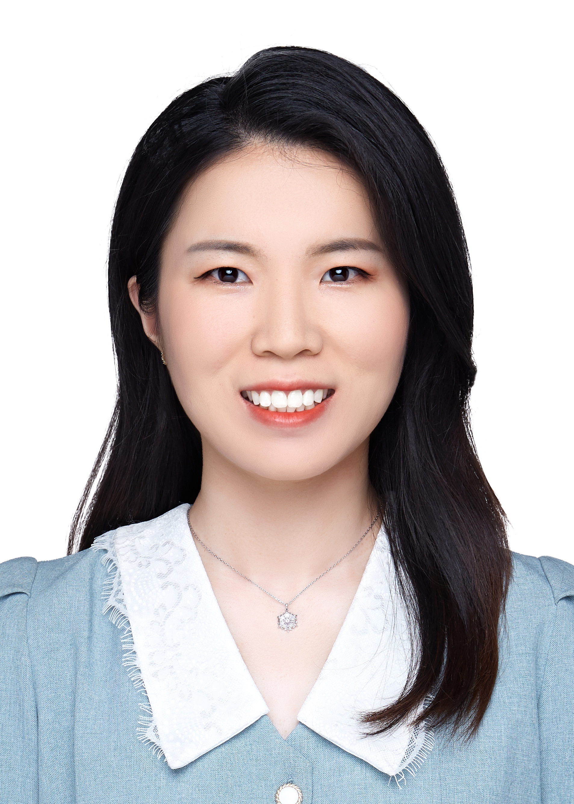

<table border="0">
  <tr>
    <td width="75%">
      <h1>Ya Jing</h1>
      
<b>ByteDance Research</b>

      
<b>jingya@bytedance.com</b>

    </td>
    <td width="25%">
      
    </td>
  </tr>
</table>  

### Biography
I received my B.E. from the Department of Automation, Beihang University, Beijing, China, in 2016. I received my Ph.D. from the Institute of Automation, Chinese Academy of Sciences (CASIA), advised by Tieniu Tan.

I am now a research scientist in ByteDance Research.

My main research interests include cross-modal learning, referring image segmentation, robot manipulation and action recognition. 

### Publication
1. Ya Jing, Tao Kong. Learning to Explore Informative Trajectories and Samples for Embodied Perception. 2023 IEEE International Conference on Robotics and Automation. (ICRA 2023)
2. Ya Jing, Xuelin Zhu, xingbin liu, Qie Sima, Tao zheng Yang, Yun hai Feng, Tao Kong. Exploring Visual Pre-training for Robot Manipulation: Datasets, Models and Methods. CoRL 2022 Workshop on Pre-training Robot Learning. (CoRL 2022 Workshop)
3. Duo Zheng, Tao Kong, Ya Jing, Jiaan Wang, Xiaojie Wang. Towards Unifying Reference Expression Generation and Comprehension. The 2022 Conference on Empirical Methods in Natural Language Processing. (EMNLP 2022)
4. Ya Jing, Tao Kong, Wei Wang, Liang Wang, Lei Li, Tieniu Tan. Locate then Segment: A Strong Pipeline for Referring Image Segmentation. 2021 IEEE/CVF Conference on Computer Vision and Pattern Recognition. (CVPR 2021)
5. Ya Jing, Wei Wang, Liang Wang, Tieniu Tan. Cross-Modal Cross-Domain Moment Alignment Network for Person Search. 2020 IEEE/CVF Conference on Computer Vision and Pattern Recognition. (CVPR 2020)
6. Ya Jing, Chenyang Si, Junbo Wang, Wei Wang, Liang Wang, Tieniu Tan. Pose-Guided Multi-Granularity Attention Network for Text-Based Person Search. 2020 Association for the Advancement of Artificial Intelligence. (AAAI 2020 oral)
7. Ya Jing, Wei Wang, Liang Wang, Tieniu Tan. Learning Aligned Image-Text Representations using Graph Attentive Relational Network. IEEE Transactionson Image Processing (TIP), 2020. 
8. Ya Jing, Junbo Wang, Wei Wang, Liang Wang, Tieniu Tan. Relational Graph Neural Network for Situation Recognition. Pattern Recognition (PR), 2020.
9. Chenyang Si, Ya Jing, Wei Wang, Liang Wang, and Tieniu Tan. Skeleton-Based Action Recognition with Spatial Reasoning and Temporal Stack Learning. 2018 IEEE/CVF Conference on European Conference on Computer Vision. (ECCV 2018)
10. Chenyang Si*, Ya Jing*, Wei Wang, Liang Wang, Tieniu Tan. Skeleton-Based Action Recognition with Hierarchical Spatial Reasoning and Temporal Stack Learning Network. Pattern Recognition (PR), 2020. (* equal contribution）
